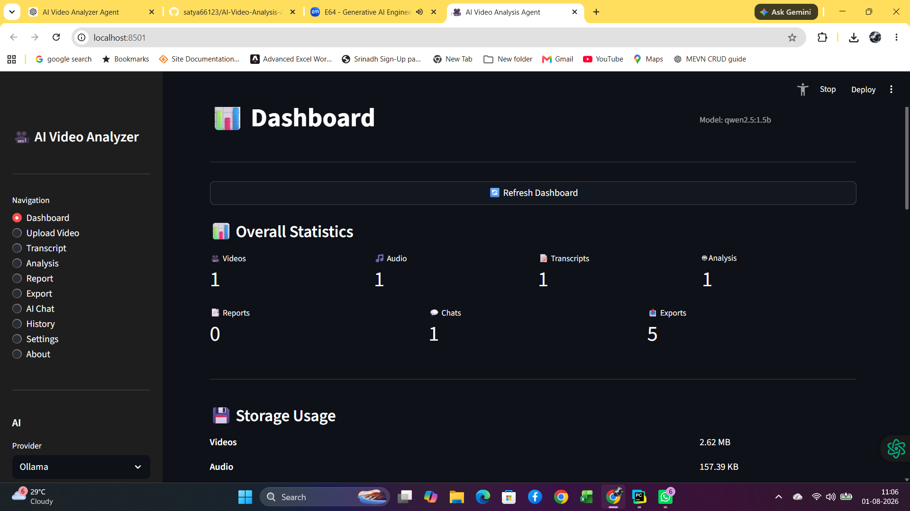
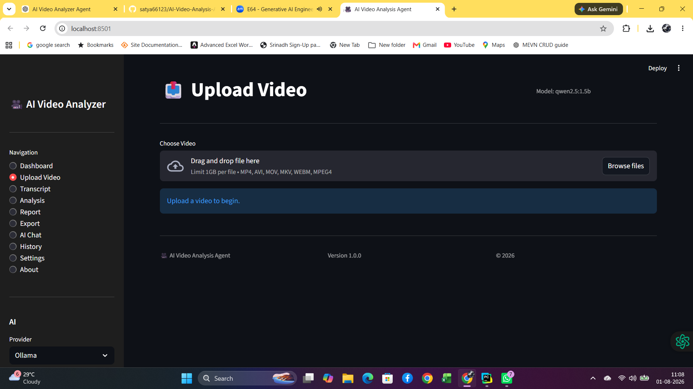
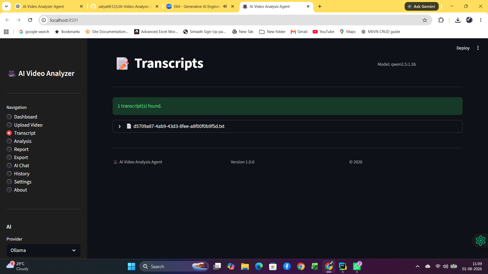
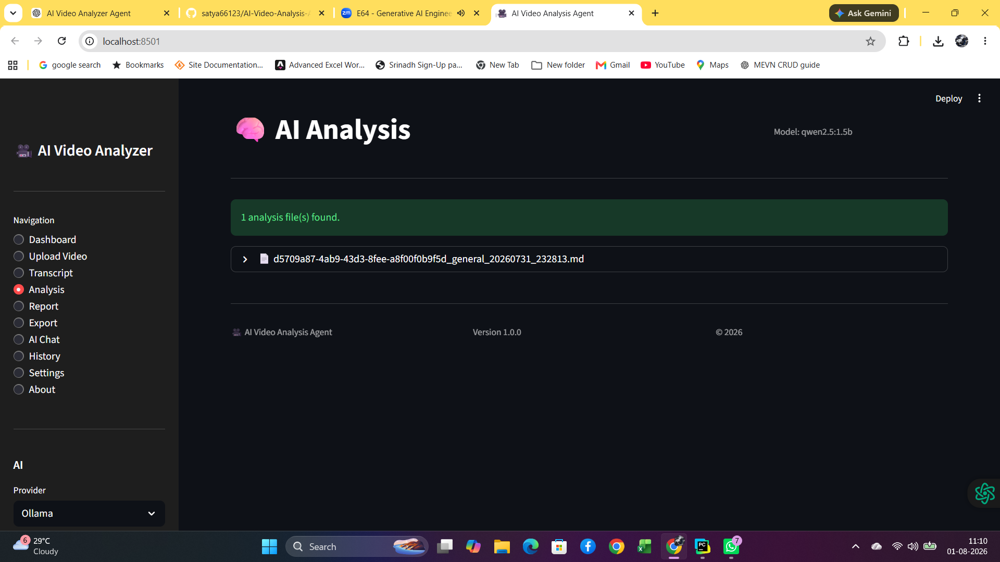
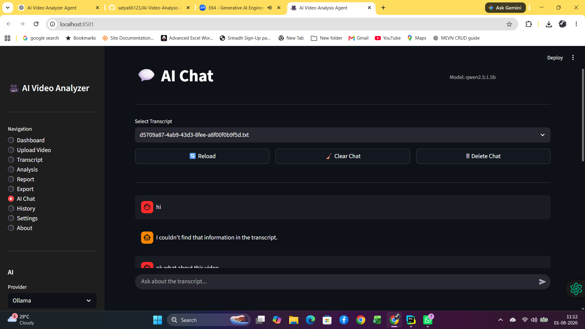
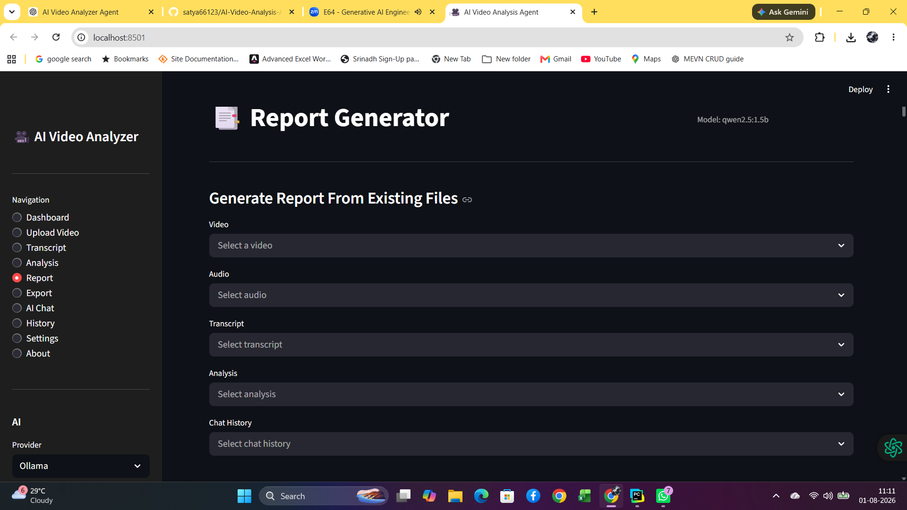
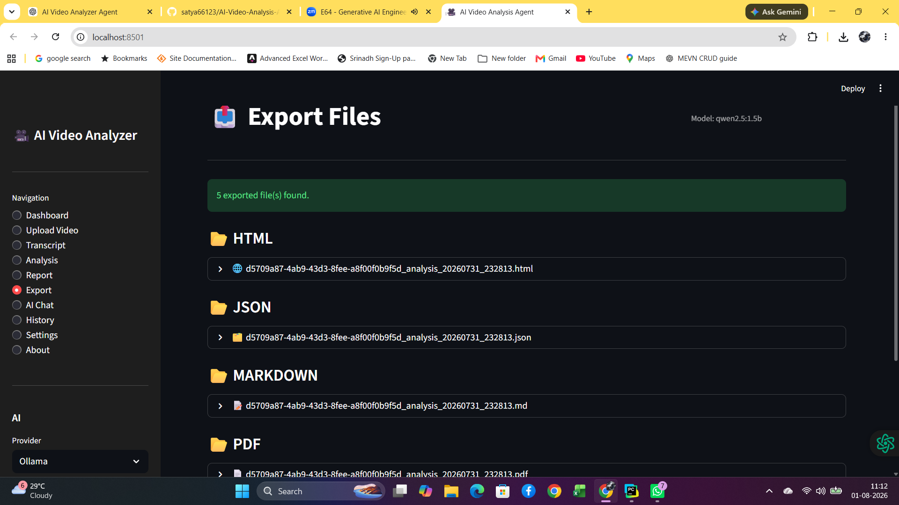
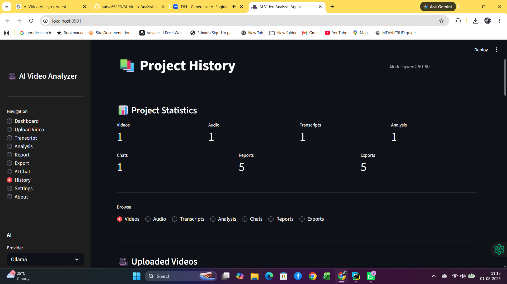
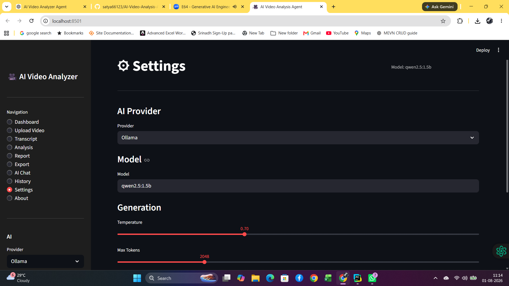
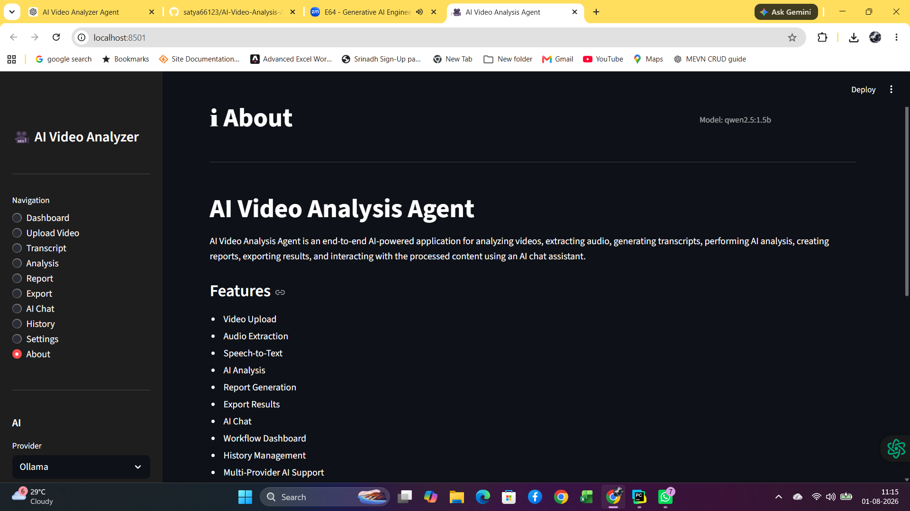

# 🎥 AI Video Analysis Agent

<p align="center">


</p>

---

## 📖 Overview

AI Video Analysis Agent is an AI-powered Streamlit application that automates the complete video analysis workflow.

The application can:

- Upload videos
- Extract metadata
- Extract audio
- Generate transcripts using Whisper
- Perform AI-powered transcript analysis
- Chat with video transcripts
- Generate professional reports
- Export reports in multiple formats

The project follows a clean **Agent → Service → Provider** architecture for modularity, maintainability, and scalability.

---

# ✨ Features

## 🎬 Video Processing

- Video Upload
- Duplicate Detection
- Video Validation
- Upload Progress
- Video Metadata Extraction

---

## 🎵 Audio Processing

- Audio Extraction
- Audio Metadata
- Audio Management

---

## 🎙 Speech Recognition

- OpenAI Whisper Integration
- Multiple Whisper Models
- Long Audio Chunking
- Transcript Generation
- Transcript Storage
- Duplicate Transcript Detection

---

## 🤖 Artificial Intelligence

- AI Transcript Analysis
- AI Chat
- Custom Prompts
- Multi-Provider Support

Supported Providers

- Ollama
- OpenAI
- Anthropic

---

## 📄 Report Generation

Generate professional reports containing:

- Video Information
- Audio Information
- Transcript
- AI Analysis
- Chat History
- Processing Metadata

---

## 📤 Export Formats

- PDF
- HTML
- Markdown
- TXT
- JSON

---

## 📚 History Management

Manage:

- Videos
- Audio
- Metadata
- Transcripts
- AI Analysis
- Chat History
- Reports
- Exported Files

---

# 🏗 Architecture

```
                Streamlit UI
                      │
                      ▼
               Workflow Manager
                      │
                      ▼
                  Agents
                      │
                      ▼
                  Services
                      │
                      ▼
              Provider Factory
                      │
        ┌─────────────┼─────────────┐
        ▼             ▼             ▼
    Ollama        OpenAI      Anthropic
                      │
                      ▼
               Local File Storage
```

---

# 🔄 Workflow

```
Upload Video
      │
      ▼
Metadata Extraction
      │
      ▼
Audio Extraction
      │
      ▼
Speech Recognition
      │
      ▼
AI Analysis
      │
      ▼
AI Chat
      │
      ▼
Report Generation
      │
      ▼
Export Reports
```

---

# 📂 Project Structure

```
AI-Video-Analysis-Agent/

app_agent.py

agents/
services/
providers/
workflows/
ui/
utils/

uploads/
audio/
metadata/
transcripts/
analysis/
chat_history/
reports/
exports/

tests/
docs/
assets/
```

---

# 🛠 Technology Stack

| Category | Technology |
|-----------|------------|
| Language | Python 3.11+ |
| UI | Streamlit |
| Speech Recognition | Whisper |
| AI Providers | Ollama, OpenAI, Anthropic |
| Video Processing | OpenCV |
| Audio Processing | FFmpeg |
| Reports | ReportLab |
| Testing | Pytest |
| Version Control | Git & GitHub |

---

## 📸 Application Screenshots

### Dashboard



---
# 📸 Application Screenshots

The following screenshots provide a visual overview of the **AI Video Analysis Agent** and its major features.

---

## 🏠 Dashboard

The Dashboard provides a centralized overview of the application and quick navigation to all AI modules.

<p align="center">

</p>

---

## 📤 Upload Video

Upload videos for processing with validation, duplicate detection, and progress tracking.

<p align="center">

</p>

---

## 🎙 Transcript Agent

Generate accurate transcripts using OpenAI Whisper with configurable models and chunk-based processing.

<p align="center">

</p>

---

## 🤖 AI Analysis Agent

Analyze transcripts using AI providers such as Ollama, OpenAI, and Anthropic to generate intelligent insights.

<p align="center">

</p>

---

## 💬 AI Chat Agent

Interact with video transcripts using an AI-powered chat interface with conversation history support.

<p align="center">

</p>

---

## 📄 Report Agent

Generate professional AI Video Analysis reports that combine metadata, transcripts, AI analysis, and chat history.

<p align="center">

</p>

---

## 📤 Export Agent

Export reports in multiple formats including PDF, HTML, Markdown, TXT, and JSON.

<p align="center">

</p>

---

## 🗂 History Agent

Browse and manage previously generated videos, transcripts, analyses, reports, and exported files.

<p align="center">

</p>

---

## ⚙ Settings

Configure AI providers, models, and application settings from a single location.

<p align="center">

</p>

---

## ℹ About

Displays project information, application version, technologies used, and developer details.

<p align="center">

</p>

---

# 🎯 Complete Workflow

```text
Dashboard
     ↓
Upload Video
     ↓
Transcript Generation
     ↓
AI Analysis
     ↓
AI Chat
     ↓
Report Generation
     ↓
Export Reports
     ↓
History Management
     ↓
Settings
     ↓
About
```

---

<p align="center">

⭐ If you like this project, please consider giving it a **Star** on GitHub!

</p>
---

# 🚀 Installation

Clone the repository

```bash
git clone https://github.com/satya66123/AI-Video-Analysis-Agent.git
```

Go to the project folder

```bash
cd AI-Video-Analysis-Agent
```

Install dependencies

```bash
pip install -r requirements.txt
```

Run the application

```bash
streamlit run app_agent.py
```

---

# 🧪 Testing

Run all tests

```bash
pytest
```

Verbose mode

```bash
pytest -v
```

Current Results

```
531 Tests Passed
0 Failed
100% Successful
```

---

# 📖 Documentation

The project includes comprehensive documentation:

- API Documentation
- Architecture Guide
- Configuration Guide
- Workflow Guide
- User Guide
- Installation Guide
- Export Guide
- Features Guide
- FAQ
- Troubleshooting Guide
- Provider Guide
- System Design
- Testing Guide
- Project Planner
- Project Structure
- Project Notes
- Security Policy
- Release Notes
- Changelog
- Contributing Guide
- Code of Conduct

---

# 📊 Project Statistics

| Item | Value |
|------|-------|
| Version | v1.0.0 |
| Architecture | Agent → Service → Provider |
| AI Providers | 3 |
| Export Formats | 5 |
| Automated Tests | 531 |
| Test Success | 100% |
| Documentation | Complete |

---

# 🗺 Roadmap

### Version 1.1

- Performance improvements
- UI enhancements
- Bug fixes

### Version 1.2

- OCR Support
- Speaker Diarization
- Subtitle Generation
- Timeline Analysis

### Version 2.0

- REST API
- Docker Support
- Database Integration
- Authentication
- Cloud Deployment

---

# 🤝 Contributing

Contributions are welcome.

Please read:

- CONTRIBUTING.md
- CODE_OF_CONDUCT.md

before submitting pull requests.

---

# 📄 License

This project is licensed under the MIT License.

---

# 👨‍💻 Author

**Nekkanti Satya Srinath**

GitHub:

**https://github.com/satya66123**

Project Repository:

**https://github.com/satya66123/AI-Video-Analysis-Agent**

---

# ⭐ Support

If you find this project useful:

- ⭐ Star the repository
- 🍴 Fork the project
- 🐞 Report issues
- 💡 Suggest new features

---

<p align="center">

**AI Video Analysis Agent v1.0.0**

Built with ❤️ using Python, Streamlit, Whisper, and AI.

</p>